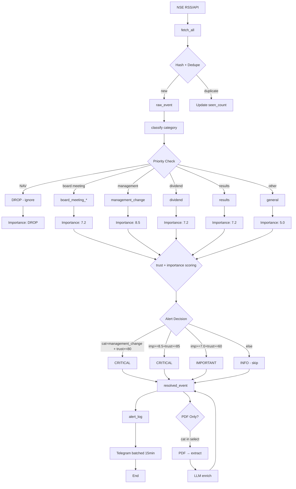

# NSE Corporate Filings Pipeline v2.1



## RSS Ingestion → Classification → Alert Flow

```
┌─────────────────────────────────────────────────────────────────────────────────────────────┐
│                           NSE RSS FEED COLLECTION (v2.1)             │
└─────────────────────────────────────────────────────────────────────────────────────────────┘
                                      │
                                      ▼
┌─────────────────────────────────────────────────────────────────────────────────────────────┐
│  STEP 1: NseRssClient.fetch_all()                                        │
│  • Fetch from nseindia.com/rss/home.aspx?subType=corp                      │
│  • Parse XML → RssItem[] (title, description, link, pub_date, guid)          │
│  • Output: 320 items fetched                                          │
└─────────────────────────────────────────────────────────────────────────────────────────────┘
                                      │
                                      ▼
┌─────────────────────────────────────────────────────────────────────────────────────────────┐
│  STEP 2: Hash + Dedupe                                                  │
│  ────────────────────────────────────────────────────────────            │
│  event_hash = SHA256(title + link + pub_date)                          │
│                                                                          │
│  IF exists:                                                              │
│      UPDATE raw_events SET seen_count = seen_count + 1,                      │
│                           last_seen_at = NOW()                          │
│  ELSE:                                                                  │
│      INSERT raw_events (...)                                              │
│                                                                          │
│  → Prevents duplicate spam from RSS glitches                         │
└─────────────────────────────────────────────────────────────────────────────────────────────┘
                                      │
                                      ▼
┌─────────────────────────────────────────────────────────────────────────────────────────────┐
│  STEP 3: Raw Event Storage (DuckDB)                                        │
│  INSERT INTO raw_events (title, link, pub_date, description, guid, ...)        │
│  • Store: title, link, pub_date, description, category, importance,        │
│         sentiment, trust_score, seen_count, last_seen_at                    │
└─────────────────────────────────────────────────────────────────────────────────────────────┘
                                      │
                                      ▼
┌─────────────────────────────────────────────────────────────────────────────────────────────┐
│  STEP 4: classify_category() - EVENT TYPE EXTRACTION                       │
│  Input: raw_event = {title, description}                                   │
│                                                                          │
│  1. Extract NSE event type:                                          │
│     desc.split("|")[-1].strip()  →  "SUBJECT: Declaration of NAV"             │
│                                                                          │
│  2. Match against NSE event types:                                   │
│                                                                          │
│     ┌─────────────────────────────────────────────────────────────────┐  │
│     │ PRIORITY 1: DROP (225 items) - No trading value              │  │
│     │ "declaration of nav" + ("Mutual Fund" OR "ETF" in title)       │  │
│     │ → DROP ENTIRELY (not stored as category)                   │  │
│     └─────────────────────────────────────────────────────────────────┘  │
│     ┌─────────────────────────────────────────────────────────────────┐  │
│     │ PRIORITY 2: Board Meetings (17 items)                      │  │
│     │ "board meeting" + "intimation"                   │  │ → board_meeting_intimation
│     │ "board meeting" + "outcome"                     │  │ → board_meeting_outcome
│     │ "board meeting" (default)                    │  │ → board_meeting
│     └─────────────────────────────────────────────────────────────────┘  │
│     ┌─────────────────────────────────────────────────────────────────┐  │
│     │ PRIORITY 3: Management Changes (6 items)        │  │
│     │ "change in directors" / "change in kmp" /       │  │
│     │ "cessation" / "demise"                      │  │ → management_change
│     └─────────────────────────────────────────────────────────────────┘  │
│     ┌─────────────────────────────────────────────────────────────────┐  │
│     │ PRIORITY 4: Corporate Actions                      │  │
│     │ "buyback" / "repurchase"                 │  │ → buyback
│     │ "dividend" / "record date"                │  │ → dividend
│     │ "rights issue" / "qip"                 │  │ → fundraise
│     │ "esop" / "esos" / "esps"              │  │ → esop_allotment
│     │ "bagging" / "award" / "loa"              │  │ → major_order_win
│     │ "result" / "quarterly"                 │  │ → results
│     └─────────────────────────────────────────────────────────────────┘  │
│     ┌─────────────────────────────────────────────────────────────────┐  │
│     │ PRIORITY 5: Regulatory (3 items)                      │  │
│     │ "sebi" / "takeover" / "regulation"          │  │ → regulatory
│     │ "deviation" / "variation"                 │  │ → deviation_statement
│     └─────────────────────────────────────────────────────────────────┘  │
│     ┌─────────────────────────────────────────────────────────────────┐  │
│     │ DEFAULT: Other (22 items)                      │  │
│     │ "press release"                  │  │ → press_release
│     │ "newspaper publication"            │  │ → newspaper_publication
│     │ "shareholders meeting"            │  │ → shareholders_meeting
│     │ "analyst" / "investor meet"       │  │ → investor_meet
│     │ (anything else)                  │  │ → general
│     └─────────────────────────────────────────────────────────────────┘  │
└─────────────────────────────────────────────────────────────────────────────────────────────┘
                                      │
                                      ▼
┌─────────────────────────────────────────────────────────────────────────────────────────────┐
│  STEP 5: Trust Scoring                                                   │
│  ────────────────────────────────────────────────────────────            │
│  trust_score = compute_trust_score(source, source_type)                 │
│                                                                          │
│  Source trust weights:                                                   │
│      nseindia.com     → 95 (official, direct)                         │
│                      → 70 (corporate filing)                          │
│                      → 50 (third-party)                               │
│                                                                          │
│  is_official = is_official_source(source, source_type)                 │
└─────────────────────────────────────────────────────────────────────────────────────────────┘
                                      │
                                      ▼
┌─────────────────────────────────────────────────────────────────────────────────────────────┐
│  STEP 6: compute_importance()                                           │
│  ────────────────────────────────────────────────────────────            │
│  importance_score = {                                                  │
│      "management_change":    8.5,  // HIGH                             │
│      "major_order_win":     8.5,  // HIGH                            │
│      "buyback":            8.5,  // HIGH                            │
│      "dividend":          7.2,  // IMPORTANT                          │
│      "results":           7.2,  // IMPORTANT                          │
│      "board_meeting_*":    7.2,  // IMPORTANT                         │
│      "fundraise":         7.2,  // IMPORTANT                          │
│      "general":           5.0,  // LOW                                │
│  }                                                                    │
└─────────────────────────────────────────────────────────────────────────────────────────────┘
                                      │
                                      ▼
┌─────────────────────────────────────────────────────────────────────────────────────────────┐
│  STEP 7: Alert Decision (TRUST + CATEGORY override)                     │
│  ────────────────────────────────────────────────────────────            │
│  Input: category, importance_score, trust_score, is_official           │
│                                                                          │
│  # CATEGORY OVERRIDE (mandatory categories)                              │
│  IF category in CRITICAL_CATEGORIES AND trust >= 80:                    │
│      return "critical"                                                  │
│                                                                          │
│  # HIGH SCORE THRESHOLD                                                 │
│  IF importance >= 8.5 AND trust >= 85:                                │
│      return "critical"                                                  │
│                                                                          │
│  # IMPORTANCE THRESHOLD                                               │
│  IF importance >= 7.0 AND trust >= 60:                                │
│      return "important"                                                 │
│                                                                          │
│  # DEFAULT                                                          │
│  return "info"                                                        │
│                                                                          │
│  CRITICAL_CATEGORIES = {management_change, regulatory, buyback,          │
│                        major_order_win, capex_expansion}                │
│  IMPORTANT_CATEGORIES = {board_meeting, results, dividend, fundraise}   │
└─────────────────────────────────────────────────────────────────────────────────────────────┘
                                      │
                                      ▼
┌─────────────────────────────────────────────────────────────────────────────────────���─���─────┐
│  STEP 8: Resolved Event Storage                                          │
│  INSERT INTO resolved_event (...)                                      │
│  • Links back to raw_event_id                                           │
│  • Stores: category, importance, trust, alert_level, summary           │
└─────────────────────────────────────────────────────────────────────────────────────────────┘
                                      │
                                      ▼
┌─────────────────────────────────────────────────────────────────────────────────────────────┐
│  STEP 9: Alert Log (prevent duplicates)                                  │
│  ────────────────────────────────────────────────────────────            │
│  IF already_sent(resolved_event_id, channel):                          │
│      SKIP                                                            │
│  ELSE:                                                                │
│      INSERT alert_log (pending)                                        │
│                                                                          │
│  → Audit trail + prevents duplicate alerts                            │
└─────────────────────────────────────────────────────────────────────────────────────────────┘
                                      │
                                      ▼
┌─────────────────────────────────────────────────────────────────────────────────────────────┐
│  STEP 10: Alert Delivery                                                 │
│  ────────────────────────────────────────────────────────────            │
│  CRITICAL → Telegram immediately                                       │
│  IMPORTANT → Telegram batched (15 min)                               │
│  INFO → Skip (logged only for reference)                               │
└─────────────────────────────────────────────────────────────────────────────────────────────┘
                                      │
                                      ▼
┌─────────────────────────────────────────────────────────────────────────────────────────────┐
│  STEP 11: PDF + LLM Enrichment (OPTIONAL - only select categories)         │
│  ────────────────────────────────────────────────────────────            │
│  PDF pipeline runs ONLY for:                                          │
│      management_change                                             │
│      regulatory                                                   │
│      buyback                                                      │
│      major_order_win                                               │
│      capex_expansion                                              │
│      fundraise                                                    │
│                                                                          │
│  If PDF exists AND category in SELECT_CATEGORIES:                    │
│      1. Download PDF                                               │
│      2. Extract text (PyMuPDF + OCR fallback)                      │
│      3. Run LLM analysis (OpenRouter)                             │
│      4. Update resolved_event with enriched data                   │
└─────────────────────────────────────────────────────────────────────────────────────────────┘
```

## Why Trust Matters

```
Without trust scoring:
  random RSS glitch    → CRITICAL alert ❌
  duplicate garbage  → IMPORTANT alert ❌
  third-party rumor   → immediate alert ❌

With trust scoring:
  NSE official       → CRITICAL only if score meets threshold
  verified source    → CRITICAL / IMPORTANT
  unverified        → INFO or skip
```

## Summary Statistics

| Stage | Count | Notes |
|-------|-------|-------|
| RSS Fetched | 320 | From NSE |
| Deduplicated | ~315 | After dedupe |
| NAV (DROP) | 225 | Filtered early |
| Stored | ~95 | Worth processing |
| CRITICAL | 9 | management_change + major_order_win |
| IMPORTANT | 17 | board_meeting + results + dividend |
| INFO | 22 | general/other |

## Key Improvements v2.1

1. **DROP NAV entirely** - 225 items with zero trading value
2. **Trust scoring** - prevents spam from unverified sources
3. **Category override** - ensures mandatory categories get alerted
4. **Dedupe with seen_count** - tracks duplicates properly
5. **alert_log** - audit trail prevents duplicates
6. **Selective PDF** - only run LLM for high-value categories