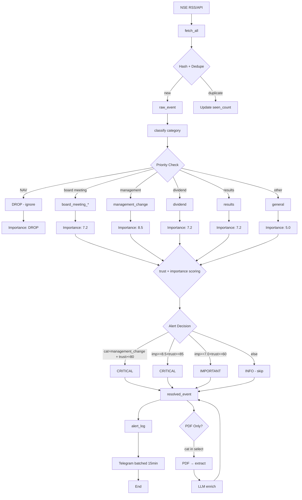

# NSE Corporate Filings Pipeline v2.1

## Exchange-listing security master V1

`market-intel-security-master-v1` acquires the official NSE active-equity CSV
and BSE active-equity JSON list as independent, versioned source snapshots.
Each source writes an immutable `listing_sync_run` receipt and normalized
`listed_security_observation` rows with source-content and source-row hashes.
The latest completed run is selected independently per exchange; a degraded
refresh cannot replace a previously valid current snapshot. These official
active lists are not historical masters: every receipt is explicitly marked
`LATEST_ONLY_OBSERVED_AT_SYNC`, and the sync command rejects backdating.

`security_listing_membership_current` joins active corporate-equity listings
only by exact valid ISIN and reports `NSE_ONLY`, `BSE_ONLY`, or `DUAL`.
`tracked_entity` remains a watchlist and is not a full security master. The
high-value shadow collector uses the master to enrich announcement identity
and provenance, but V1 does not suppress dual-listed BSE metadata before
cross-exchange overlap and incremental coverage have been measured. Collection
fails before any source request when a requested exchange has no completed
master snapshot; a degraded refresh does not displace an older completed one.

## High-value shadow lane V1

`market-intel-high-value-filter-v1` is an isolated metadata-first lane over the
official NSE announcement API and BSE corporate-announcement endpoint. Each
bounded source window writes an `announcement_collection_run` coverage receipt
and one immutable `announcement_filter_decision` per announcement. Decisions
are `KEEP`, `FETCH_ATTACHMENT`, or `DROP_METADATA_ONLY`; they control attachment
eligibility only and never assert a verified corporate fact.

`market-intel-jcurve-targeted-backfill-v1` consumes a completed immutable
research-screener primary queue by exact identity. It fetches full metadata for
each requested exchange in at most 32-day chunks, retains only cohort
announcements, applies the same high-value attachment gate, and writes resumable
run/target/chunk receipts. Complete exchange responses—not the retained
subset—establish source coverage. Frozen cohorts use NSE as the primary source
for every NSE-listed member and require BSE coverage only for a BSE-only member.
Cross-listed exact ISIN/date/normalized-title duplicates prefer NSE; all other
official source events remain independently auditable.

The default shadow command stores metadata and decisions without downloading
attachments or calling an LLM. After a completed metadata backfill,
`download-attachments` selects only strong J-curve signals with fetchable
HTTP(S) URLs, records a separate resumable attachment receipt, validates
existing file hashes, stores new files beside the configured database, and
suppresses operational LLM enrichment. Candidate selection covers both newly
inserted rows and matching cohort events already present in the proven parent
window. Relative legacy paths are not treated as reusable because their meaning
depends on the caller's working directory. A
failed source window is persisted as `DEGRADED` with
`pages_complete = FALSE`, rather than being treated as an empty successful day.

BSE collection follows the current official `AnnSubCategoryGetData` contract.
Because that endpoint silently returns an empty object for multi-day requests,
the collector splits every requested range into single-day windows, records
every response-page hash, and follows `Table1[0].ROWCNT` until all reported
50-row pages have been acquired for every date. A malformed, failed, or
repeated page leaves the window incomplete. Duplicate source announcement IDs
are counted in the run summary but produce only one immutable filter decision
and do not degrade an otherwise complete collection window.

Calibration uses `export-review` over explicitly named completed collection
runs. The immutable export records source receipts, population and sample
mixes, deterministic seed, and dataset hash. Sampling round-robins across source
and listing-membership strata for each decision, then unions every announcement
matching an optional exact-ISIN cohort. Review labels remain null until a human
assigns `HIGH_VALUE` or `NOT_HIGH_VALUE`; aggregate routing counts are not a
substitute for precision and recall. Calibration rejects incomplete labeling by
default. `--allow-partial` supports interim batch review, explicitly reports
coverage and `PARTIAL` status, and is not promotion evidence.



## RSS Ingestion → Classification → Alert Flow

```
┌─────────────────────────────────────────────────────────────────────────────────────────────┐
│                           NSE RSS FEED COLLECTION (v2.1)             │
└─────────────────────────────────────────────────────────────────────────────────────────────┘
                                      │
                                      ▼
┌─────────────────────────────────────────────────────────────────────────────────────────────┐
│  STEP 1: NseRssClient.fetch_all()                                        │
│  • Fetch from nseindia.com/rss/home.aspx?subType=corp                      │
│  • Parse XML → RssItem[] (title, description, link, pub_date, guid)          │
│  • Output: 320 items fetched                                          │
└─────────────────────────────────────────────────────────────────────────────────────────────┘
                                      │
                                      ▼
┌─────────────────────────────────────────────────────────────────────────────────────────────┐
│  STEP 2: Hash + Dedupe                                                  │
│  ────────────────────────────────────────────────────────────            │
│  event_hash = SHA256(title + link + pub_date)                          │
│                                                                          │
│  IF exists:                                                              │
│      UPDATE raw_events SET seen_count = seen_count + 1,                      │
│                           last_seen_at = NOW()                          │
│  ELSE:                                                                  │
│      INSERT raw_events (...)                                              │
│                                                                          │
│  → Prevents duplicate spam from RSS glitches                         │
└─────────────────────────────────────────────────────────────────────────────────────────────┘
                                      │
                                      ▼
┌─────────────────────────────────────────────────────────────────────────────────────────────┐
│  STEP 3: Raw Event Storage (DuckDB)                                        │
│  INSERT INTO raw_events (title, link, pub_date, description, guid, ...)        │
│  • Store: title, link, pub_date, description, category, importance,        │
│         sentiment, trust_score, seen_count, last_seen_at                    │
└─────────────────────────────────────────────────────────────────────────────────────────────┘
                                      │
                                      ▼
┌─────────────────────────────────────────────────────────────────────────────────────────────┐
│  STEP 4: classify_category() - EVENT TYPE EXTRACTION                       │
│  Input: raw_event = {title, description}                                   │
│                                                                          │
│  1. Extract NSE event type:                                          │
│     desc.split("|")[-1].strip()  →  "SUBJECT: Declaration of NAV"             │
│                                                                          │
│  2. Match against NSE event types:                                   │
│                                                                          │
│     ┌─────────────────────────────────────────────────────────────────┐  │
│     │ PRIORITY 1: DROP (225 items) - No trading value              │  │
│     │ "declaration of nav" + ("Mutual Fund" OR "ETF" in title)       │  │
│     │ → DROP ENTIRELY (not stored as category)                   │  │
│     └─────────────────────────────────────────────────────────────────┘  │
│     ┌─────────────────────────────────────────────────────────────────┐  │
│     │ PRIORITY 2: Board Meetings (17 items)                      │  │
│     │ "board meeting" + "intimation"                   │  │ → board_meeting_intimation
│     │ "board meeting" + "outcome"                     │  │ → board_meeting_outcome
│     │ "board meeting" (default)                    │  │ → board_meeting
│     └─────────────────────────────────────────────────────────────────┘  │
│     ┌─────────────────────────────────────────────────────────────────┐  │
│     │ PRIORITY 3: Management Changes (6 items)        │  │
│     │ "change in directors" / "change in kmp" /       │  │
│     │ "cessation" / "demise"                      │  │ → management_change
│     └─────────────────────────────────────────────────────────────────┘  │
│     ┌─────────────────────────────────────────────────────────────────┐  │
│     │ PRIORITY 4: Corporate Actions                      │  │
│     │ "buyback" / "repurchase"                 │  │ → buyback
│     │ "dividend" / "record date"                │  │ → dividend
│     │ "rights issue" / "qip"                 │  │ → fundraise
│     │ "esop" / "esos" / "esps"              │  │ → esop_allotment
│     │ "bagging" / "award" / "loa"              │  │ → major_order_win
│     │ "result" / "quarterly"                 │  │ → results
│     └─────────────────────────────────────────────────────────────────┘  │
│     ┌─────────────────────────────────────────────────────────────────┐  │
│     │ PRIORITY 5: Regulatory (3 items)                      │  │
│     │ "sebi" / "takeover" / "regulation"          │  │ → regulatory
│     │ "deviation" / "variation"                 │  │ → deviation_statement
│     └─────────────────────────────────────────────────────────────────┘  │
│     ┌─────────────────────────────────────────────────────────────────┐  │
│     │ DEFAULT: Other (22 items)                      │  │
│     │ "press release"                  │  │ → press_release
│     │ "newspaper publication"            │  │ → newspaper_publication
│     │ "shareholders meeting"            │  │ → shareholders_meeting
│     │ "analyst" / "investor meet"       │  │ → investor_meet
│     │ (anything else)                  │  │ → general
│     └─────────────────────────────────────────────────────────────────┘  │
└─────────────────────────────────────────────────────────────────────────────────────────────┘
                                      │
                                      ▼
┌─────────────────────────────────────────────────────────────────────────────────────────────┐
│  STEP 5: Trust Scoring                                                   │
│  ────────────────────────────────────────────────────────────            │
│  trust_score = compute_trust_score(source, source_type)                 │
│                                                                          │
│  Source trust weights:                                                   │
│      nseindia.com     → 95 (official, direct)                         │
│                      → 70 (corporate filing)                          │
│                      → 50 (third-party)                               │
│                                                                          │
│  is_official = is_official_source(source, source_type)                 │
└─────────────────────────────────────────────────────────────────────────────────────────────┘
                                      │
                                      ▼
┌─────────────────────────────────────────────────────────────────────────────────────────────┐
│  STEP 6: compute_importance()                                           │
│  ────────────────────────────────────────────────────────────            │
│  importance_score = {                                                  │
│      "management_change":    8.5,  // HIGH                             │
│      "major_order_win":     8.5,  // HIGH                            │
│      "buyback":            8.5,  // HIGH                            │
│      "dividend":          7.2,  // IMPORTANT                          │
│      "results":           7.2,  // IMPORTANT                          │
│      "board_meeting_*":    7.2,  // IMPORTANT                         │
│      "fundraise":         7.2,  // IMPORTANT                          │
│      "general":           5.0,  // LOW                                │
│  }                                                                    │
└─────────────────────────────────────────────────────────────────────────────────────────────┘
                                      │
                                      ▼
┌─────────────────────────────────────────────────────────────────────────────────────────────┐
│  STEP 7: Alert Decision (TRUST + CATEGORY override)                     │
│  ────────────────────────────────────────────────────────────            │
│  Input: category, importance_score, trust_score, is_official           │
│                                                                          │
│  # CATEGORY OVERRIDE (mandatory categories)                              │
│  IF category in CRITICAL_CATEGORIES AND trust >= 80:                    │
│      return "critical"                                                  │
│                                                                          │
│  # HIGH SCORE THRESHOLD                                                 │
│  IF importance >= 8.5 AND trust >= 85:                                │
│      return "critical"                                                  │
│                                                                          │
│  # IMPORTANCE THRESHOLD                                               │
│  IF importance >= 7.0 AND trust >= 60:                                │
│      return "important"                                                 │
│                                                                          │
│  # DEFAULT                                                          │
│  return "info"                                                        │
│                                                                          │
│  CRITICAL_CATEGORIES = {management_change, regulatory, buyback,          │
│                        major_order_win, capex_expansion}                │
│  IMPORTANT_CATEGORIES = {board_meeting, results, dividend, fundraise}   │
└─────────────────────────────────────────────────────────────────────────────────────────────┘
                                      │
                                      ▼
┌─────────────────────────────────────────────────────────────────────────────────────���─���─────┐
│  STEP 8: Resolved Event Storage                                          │
│  INSERT INTO resolved_event (...)                                      │
│  • Links back to raw_event_id                                           │
│  • Stores: category, importance, trust, alert_level, summary           │
└─────────────────────────────────────────────────────────────────────────────────────────────┘
                                      │
                                      ▼
┌─────────────────────────────────────────────────────────────────────────────────────────────┐
│  STEP 9: Alert Log (prevent duplicates)                                  │
│  ────────────────────────────────────────────────────────────            │
│  IF already_sent(resolved_event_id, channel):                          │
│      SKIP                                                            │
│  ELSE:                                                                │
│      INSERT alert_log (pending)                                        │
│                                                                          │
│  → Audit trail + prevents duplicate alerts                            │
└─────────────────────────────────────────────────────────────────────────────────────────────┘
                                      │
                                      ▼
┌─────────────────────────────────────────────────────────────────────────────────────────────┐
│  STEP 10: Alert Delivery                                                 │
│  ────────────────────────────────────────────────────────────            │
│  CRITICAL → Telegram immediately                                       │
│  IMPORTANT → Telegram batched (15 min)                               │
│  INFO → Skip (logged only for reference)                               │
└─────────────────────────────────────────────────────────────────────────────────────────────┘
                                      │
                                      ▼
┌─────────────────────────────────────────────────────────────────────────────────────────────┐
│  STEP 11: PDF + LLM Enrichment (OPTIONAL - only select categories)         │
│  ────────────────────────────────────────────────────────────            │
│  PDF pipeline runs ONLY for:                                          │
│      management_change                                             │
│      regulatory                                                   │
│      buyback                                                      │
│      major_order_win                                               │
│      capex_expansion                                              │
│      fundraise                                                    │
│                                                                          │
│  If PDF exists AND category in SELECT_CATEGORIES:                    │
│      1. Download PDF                                               │
│      2. Extract text (PyMuPDF + OCR fallback)                      │
│      3. Run LLM analysis (OpenRouter)                             │
│      4. Update resolved_event with enriched data                   │
└─────────────────────────────────────────────────────────────────────────────────────────────┘
```

## Why Trust Matters

```
Without trust scoring:
  random RSS glitch    → CRITICAL alert ❌
  duplicate garbage  → IMPORTANT alert ❌
  third-party rumor   → immediate alert ❌

With trust scoring:
  NSE official       → CRITICAL only if score meets threshold
  verified source    → CRITICAL / IMPORTANT
  unverified        → INFO or skip
```

## Summary Statistics

| Stage | Count | Notes |
|-------|-------|-------|
| RSS Fetched | 320 | From NSE |
| Deduplicated | ~315 | After dedupe |
| NAV (DROP) | 225 | Filtered early |
| Stored | ~95 | Worth processing |
| CRITICAL | 9 | management_change + major_order_win |
| IMPORTANT | 17 | board_meeting + results + dividend |
| INFO | 22 | general/other |

## Key Improvements v2.1

1. **DROP NAV entirely** - 225 items with zero trading value
2. **Trust scoring** - prevents spam from unverified sources
3. **Category override** - ensures mandatory categories get alerted
4. **Dedupe with seen_count** - tracks duplicates properly
5. **alert_log** - audit trail prevents duplicates
6. **Selective PDF** - only run LLM for high-value categories
